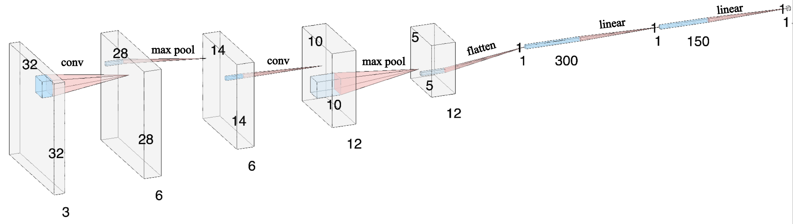

# Facemask Recognition

## Giới Thiệu

Do module phát hiện khuôn mặt vẫn phát hiện được khuôn mặt khi đeo khẩu trang, điều này dẫn đến rủi ro cho hệ thống khi đăng ký khuôn mặt vào cơ sở dữ liệu cũng như xác nhận khuôn mặt. Do đó cần có một bộ phân loại để loại bỏ các trường hợp đeo khẩu trang.

## Chuẩn bị dữ liệu huấn luyện

Tập data sử dụng để train và đánh giá model được lấy từ [Face Mask Detection Dataset](https://www.kaggle.com/datasets/omkargurav/face-mask-dataset). 
Tập data gồm hai loại: 

- Ảnh người đeo khẩu trang (with_mask)

- Ảnh người không đeo khẩu trang (without_mask)

Tuy nhiên, ngoài khuôn mặt, ảnh trong tập data chứa nhiều thành phần khác như background, vai, mũ nón... Vì vậy, ta sẽ sử dụng model phát hiện khuôn mặt được trình bày ở mục 2.2 để tạo một tập data mới chỉ chứa khuôn mặt từ tập data cũ.

Để download và trích xuất data, ta sử dụng những lệnh sau đây.

```
kaggle datasets download -d omkargurav/face-mask-dataset
unzip face-mask-dataset.zip
mv data/with_mask data/1
mv data/without_mask data/0
python3 extract_face.py
```

## Xác định cấu trúc model

Mạng Convolutional Neural Network (CNN) được ứng dụng rộng rãi trong các bài toán xử lý ảnh. Trong bài này, chúng ta sẽ xây dựng một mạng CNN với cấu trúc như hình bên dưới. Lớp input nhận vào một ảnh có 3 channel và kích thước 32 x 32. Kích thước này được tham khảo từ Kaggle blog. Vì đặc trưng khẩu trang khá rõ ràng, nên dù kích thước input nhỏ, nhưng model vẫn cho kết quả chấp nhận được. Tại hidden layer, ta kết hợp lớp convolution và lớp max pool để làm giảm kích thước của ảnh mà vẫn giữ lại thông tin của bức ảnh nhiều nhất. Lớp flatten giúp chuyển data trên các convolution filter từ dạng đa chiều về một chiều. Sau lớp flatten, bức ảnh có kích thước 3 x 32 x 32 đã được chuyển đổi về dạng mảng 1 chiều của 300 đặc trưng. Tại đây, ta kết hợp linear regression và logistic regression để đưa output về 1 con số duy nhất thể hiện xác suất ảnh đó có khẩu trang hay không.



## Training và đánh giá model

Train dataset có 5515 ảnh. Vì số lượng ảnh lớn nên ta chia train dataset thành các batch nhỏ, mỗi batch chứa 4 ảnh. Và thực hiện train lần lượt trên các batch.

Model được train với khoảng 20 epoch và learning rate là 0.001. Hàm loss được sử dụng là Binary Cross Entropy. Phương pháp được sử dụng để tối ưu bộ trọng số là Stochastic Gradient Descent.

Để train và xem kết quả đánh giá model, ta dùng lệnh sau đây.  
`python3 train_model.py`

## Hướng dẫn sử dụng inference module

Model trả về một số p trong khoảng [0, 1] thể hiện xác suất người trong ảnh có đeo khẩu trang hay không. Số càng lớn thì khả năng người đó đeo khẩu trang càng cao.
Để đưa đến người dùng dự đoán cuối cùng, ta sử dụng phương pháp chọn số nguyên gần nhất với xác suất model đưa ra, cụ thể trong trường hợp xác suất p lớn hơn hoặc bằng 0.5, ta dự đoán người trong ảnh có đeo khẩu trang. Và ngược lại, khi xác suất nhỏ hơn 0.5, ta dự đoán người trong ảnh không đeo khẩu trang. Đoạn code sau đây mình hoạ cách sử dụng model.  

```

from facemask_model import *
import PIL

model = FacemaskRecognizeModel()
load_pretrain(model, 'pretrain/mask-reg.pth')

img = PIL.Image.open('input.png')
is_mask_exist = predict(model, img) 

```

## Nguồn tham khảo

- Source code Face Detect của thành viên Nguyễn Y Hợp

- [Face Mask Detection Kaggle Notebook](https://www.kaggle.com/code/charlessamuel/face-mask-detection-pytorch)


## Thành viên thực hiện

- Nguyễn Y Hợp - 22C15006

- Nguyễn Đăng Khoa - 22C15010

- Phạm Minh Thạch - 22C15018


